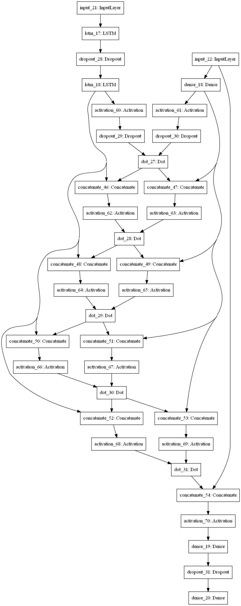

# dot-res-lstm
Classification of ECG signals by dot Residual LSTM Network for anomaly detection

### Contents

- [x] dot-res-lstm for ECG
- [x] VAE data generation
- [x] Weights 
- [ ] GAN

### Model Architecture

